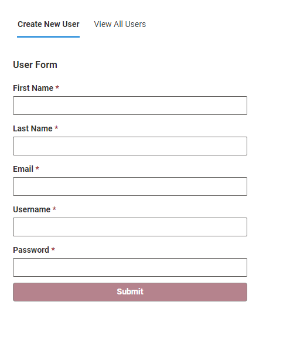

## Project Description
Welcome! This is a tiny form app. This project includes:
- A REST api currently versioned at `v1`, this is our server which includes the routes
  - GET `/v1` which fetches all users currently in our "database", a `users.json` file
  - GET `/v1/user/{:id}` which fetches a single user by their id
  - POST `/v1` which creates a new user and stores them in our `users.json` database
  - DELETE `/v1/user/{:id}` deletes a user by their id
- A frontend which includes a view to **Create a New User** and **View All Users**. A user can only view the table of all users if they are logged in as the admin.
  - There's basic form validation on the **Create a New User** view
  - A user can be deleted from our database using a **delete** button on the **All Users Table**

**Image 1:** Screenshot of the **New User Form** view



**Image 2:** Screenshot of the **View All Users** view


Only an admin can view all users. To log in as admin, enter the username and password:

```
username: superuser
password: secretpassword
```


## Run this project locally

In the root folder, run `yarn`.

Open a cli and run `yarn start:webapp`to run the **front-end** of this cpplication (`src/client`):
  - Go to `http://localhost:3001/` in your favorite browser to view the frontend.

Open another cli and run `yarn start:server` to run the **server** of this application (`src/server`):
  - Use `http://localhost:8000/` to make requests against the backend.

## Run App in Production Mode

In order to run the web application in production mode, run `yarn start` which will automatically build and serve the frontend and backend simultaneously. Then go to `http://localhost:8000/` to view the app and create / view / delete users from the UI. Wait for the yarn command to finish, you should see a screen like:


## If I had more time

If I had more time to work on this app:
- Create another view **User Profile** to display things like a user profile, description, etc.
  - I would expand the user model to reflect what a real user model might look like in a "real app". This includes adding in a profile image.
- On that note, I would add more routes to the api, such as a `PATCH /v1/{id}` endpoint
- Write tests for the api! This will help alert us if any portion of our api breaks.
